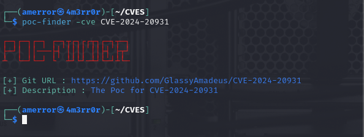
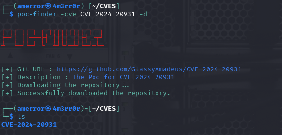

# poc-finder
CVE Checker is a simple Go program that allows you to retrieve information about Common Vulnerabilities and Exposures (CVEs) from GitHub repositories.

## Features
- Fetch CVE details based on the CVE ID.
- Optionally clone the GitHub repository associated with the CVE.

 
## Installation
If you have Go installed and configured (i.e. with `$GOPATH/bin` in your `$PATH`)

```
go install -v github.com/4m3rr0r/poc-finder@latest
```
## Usage

```
poc-finder -cve CVE-XXXX-XXXX
```


## To clone the associated GitHub repository, add the -d flag:

```
poc-finder -cve CVE-XXXX-XXXX -d
```


## Sources

Please feel free to issue pull requests with new sources! :)
